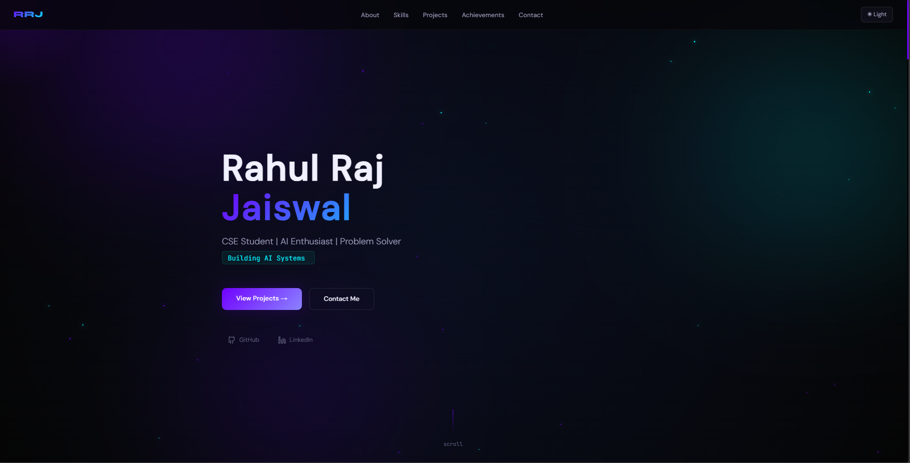
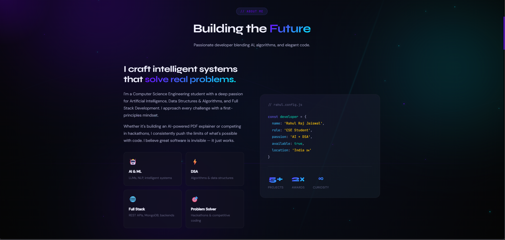
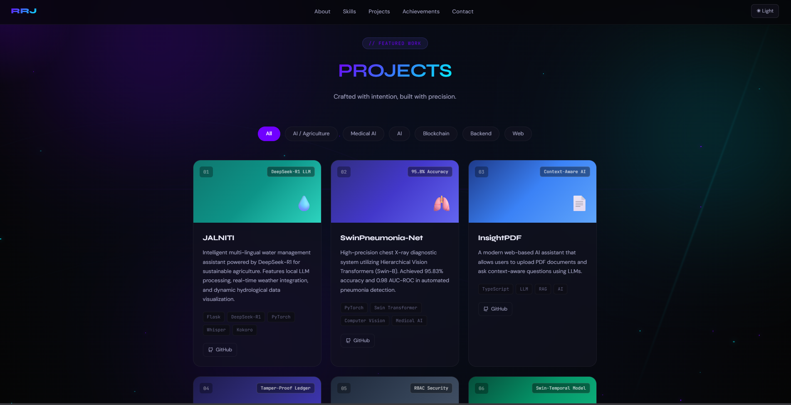
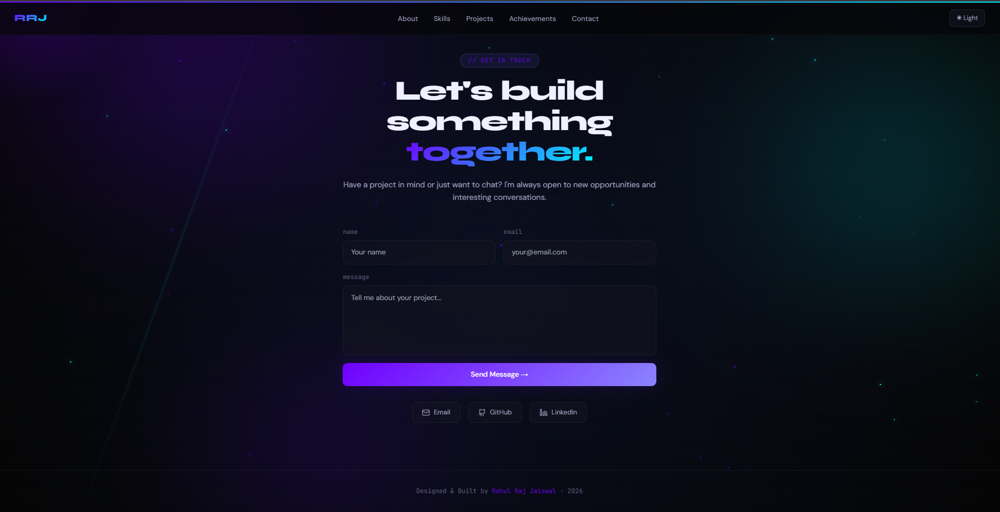

<div align="center">

# Rahul Raj Jaiswal — Developer Portfolio

**A modern, high-performance developer portfolio built with Next.js 14, TypeScript, Tailwind CSS, and Framer Motion.**

[](https://rrj-portfolio.vercel.app/)
[](https://github.com/Rahul130405/PORTFOLIO)
[](https://nextjs.org/)
[](https://www.typescriptlang.org/)
[](https://tailwindcss.com/)
[](LICENSE)

</div>

---

## 📖 Table of Contents

- [Overview](#-overview)
- [Live Demo & Interface Preview](#-live-demo--interface-preview)
- [Key Features](#-key-features)
- [Portfolio Sections](#-portfolio-sections)
- [Architecture & Data Flow](#-architecture--data-flow)
- [Tech Stack](#-tech-stack)
- [Repository Structure](#-repository-structure)
- [Getting Started](#-getting-started)
  - [Prerequisites](#prerequisites)
  - [Installation](#installation)
  - [Environment Configuration](#environment-configuration)
  - [Running Locally](#running-locally)
  - [Building for Production](#building-for-production)
- [Customization Guide](#-customization-guide)
- [Deployment](#-deployment)
- [License](#-license)

---

## 🌟 Overview

This repository contains the complete source code for **Rahul Raj Jaiswal's Developer Portfolio**, an interactive single-page web application engineered to showcase technical projects, engineering work experience, academic milestones, competitive programming achievements, and direct communication channels.

The project is built on the **Next.js 14 App Router** with a strict **data-driven design pattern**: all dynamic portfolio content (bio, projects, skills, history, and achievements) is decoupled from layout components and centralized in a structured TypeScript data store. The user interface employs a dark space design system with warm gold (`#C9A227`) and cyan (`#4FB3AC`) accents, subtle grid backdrops, glassmorphism, responsive category filters, and an animated SVG knowledge graph.

### Core Objectives

- **High Performance**: Clean component rendering with zero unnecessary client re-renders and optimized Google fonts loaded via `next/font`.
- **Decoupled Content**: Complete separation between presentation components and content data models.
- **Serverless Form Handling**: Secure email dispatch via Next.js Server Actions and the Resend API without exposing client credentials.
- **Micro-Interactions**: Scroll progress tracking, 3D card tilt effects, and CSS keyframe animations.

---

## 🌐 Live Demo & Interface Preview

The application is deployed and maintained on **Vercel**:

👉 **Live URL:** [https://rrj-portfolio.vercel.app/](https://rrj-portfolio.vercel.app/)

<div align="center">
  <table>
    <tr>
      <td width="50%">
        <br />
        <b>Hero Section & Animated Knowledge Graph</b>
      </td>
      <td width="50%">
        <br />
        <b>About Overview & Config Card</b>
      </td>
    </tr>
    <tr>
      <td width="50%">
        <br />
        <b>Categorized Project Showcase</b>
      </td>
      <td width="50%">
        <br />
        <b>Serverless Contact System</b>
      </td>
    </tr>
  </table>
</div>

---

## ✨ Key Features

- **⚡ Next.js 14 App Router Architecture**: Uses modern React 18 patterns, Server Actions, and client-side hydration boundaries.
- **🗂️ Centralized Single Source of Truth**: All personal details, work history, projects, and skills are maintained in `src/data/portfolio.ts` with strict TypeScript typing.
- **🎨 Bespoke Dark Aesthetic**: Custom CSS variables for a dark space palette with golden and teal accents, glassmorphic blur effects (`backdrop-filter`), and a 40px grid backdrop.
- **🕸️ Interactive SVG Network Graph**: An SVG knowledge graph in the hero section with animated pulse edges that visualize system connectivity.
- **🔍 Real-Time Category Filtering**: Instant client-side filtering of projects across multiple disciplines (AI, EdTech, Blockchain, Computer Vision, Security, Web).
- **📬 Production-Ready Contact System**: Server-side contact form powered by Next.js Server Actions and Resend, featuring real-time submission states (`sending`, `success`, `error`).
- **📊 Top Scroll Progress Bar**: A fixed gradient indicator dynamically reflecting page scroll depth via custom React hooks.
- **📱 Fully Responsive**: Custom layouts optimized for desktops, tablets, and mobile viewports.

---

## 🧩 Portfolio Sections

The portfolio is architected into focused sections, each serving a distinct informational purpose:

| Section | Component | Description |
| :--- | :--- | :--- |
| **Navbar** | `Navbar.tsx` | Fixed glassmorphism header with navigation anchors and a synchronized top progress bar. |
| **Hero** | `HeroSection.tsx` | Developer intro, role pills, call-to-action triggers, social links, and the animated SVG knowledge graph. |
| **About** | `AboutSection` | Narrative bio, foundational pillars (AI/ML, DSA, Full Stack, Problem Solving), and an interactive pseudo-code config card. |
| **Skills** | `SkillsSection` | Categorized tech stack badges with color-coded categories (Languages, ML/AI, Cybersecurity, Backend & DB, Tools, Core CS). |
| **Experience** | `ExperienceSection` | Timeline of professional software engineering and leadership roles at StartIQOS AI and TokenTitan Club. |
| **Education** | `EducationSection` | Academic background cards detailing undergraduate degree and foundational schooling. |
| **Projects** | `ProjectsSection.tsx` | Interactive project showcase with dynamic category filtering, GitHub links, and live deployment links. |
| **Achievements** | `AchievementsSection` | Vertical milestone timeline highlighting hackathon wins, national summit ranks, and coding streaks. |
| **Contact** | `ContactSection` | Secure form dispatching messages directly to email via Next.js Server Actions, accompanied by direct social links. |
| **Footer** | `page.tsx` | Dynamic year stamping and developer attribution. |

---

## 🏗️ Architecture & Data Flow

```text
                               ┌───────────────────────────┐
                               │   Client Browser Window   │
                               └─────────────┬─────────────┘
                                             │
                                             ▼
                               ┌───────────────────────────┐
                               │   Root Layout (layout.tsx)│
                               │  - Google Fonts Injection │
                               │  - SEO Metadata & Favicon │
                               └─────────────┬─────────────┘
                                             │
                                             ▼
                               ┌───────────────────────────┐
                               │     Main Page (page.tsx)  │
                               │  - Scroll Restoration     │
                               │  - useReveal Intersection │
                               └──────┬─────────────┬──────┘
                                      │             │
                ┌─────────────────────┘             └─────────────────────┐
                ▼                                                         ▼
  ┌───────────────────────────┐                             ┌───────────────────────────┐
  │   Layout & Background     │                             │   Interactive Sections    │
  │  - Navbar (Scroll Bar)    │                             │  - HeroSection (SVG Graph)│
  │  - Background (Grid/Glow) │                             │  - Projects (Filter Tabs) │
  └─────────────┬─────────────┘                             │  - OtherSections (About,  │
                │                                           │    Skills, Exp, Edu, etc.)│
                │                                           └─────────────┬─────────────┘
                │                                                         │
                └─────────────────────────┬───────────────────────────────┘
                                          │
                                          ▼
                            ┌───────────────────────────┐
                            │    Central Data Store     │
                            │  (src/data/portfolio.ts)  │
                            │  - Projects, Bio, Skills  │
                            │  - Experience & Milestones│
                            └─────────────┬─────────────┘
                                          │
                               (Contact Form Submit)
                                          │
                                          ▼
                            ┌───────────────────────────┐
                            │  Server Action (actions)  │
                            │  - FormData Extraction    │
                            │  - API Key Validation     │
                            └─────────────┬─────────────┘
                                          │
                                          ▼
                            ┌───────────────────────────┐
                            │        Resend API         │
                            │  - Transactional Email    │
                            └───────────────────────────┘
```

---

## 🛠️ Tech Stack

### Core Framework & Language

| Technology | Version | Purpose |
| :--- | :--- | :--- |
| **[Next.js](https://nextjs.org/)** | `14.2.0` | React framework with App Router, SSR, and Server Actions |
| **[React](https://react.dev/)** | `^18.0.0` | Declarative component UI library |
| **[TypeScript](https://www.typescriptlang.org/)** | `^5.0.0` | Static typing, interface definitions, and compile-time safety |

### Styling & UI Components

| Technology | Version | Purpose |
| :--- | :--- | :--- |
| **[Tailwind CSS](https://tailwindcss.com/)** | `^3.4.1` | Utility-first CSS framework with custom animations |
| **[PostCSS](https://postcss.org/)** | `^8.0.0` | CSS transformations and vendor prefixing |
| **[Framer Motion](https://www.framer.com/motion/)** | `^11.0.0` | Motion graphics and UI transitions |
| **[Lucide React](https://lucide.dev/)** | `^0.383.0` | Modern SVG iconography |
| **[clsx](https://github.com/lukeed/clsx)** | `^2.1.0` | Utility for conditionally constructing `className` strings |

### Backend, Delivery & Tooling

| Technology | Purpose |
| :--- | :--- |
| **[Resend](https://resend.com/)** | Server-side transactional email delivery via API SDK |
| **[Vercel](https://vercel.com/)** | Edge deployment, global CDN, and automated CI/CD builds |
| **[ESLint](https://eslint.org/)** | Code quality enforcement (`eslint-config-next`) |

---

## 📂 Repository Structure

```
portfolio/
├── .env.local                   # Local environment secrets (RESEND_API_KEY)
├── .eslintrc.json               # ESLint configuration
├── .gitignore                   # Git exclusion rules
├── next-env.d.ts                # Next.js TypeScript definitions
├── next.config.js               # Next.js runtime & image domain configuration
├── package.json                 # Project dependencies, scripts, and metadata
├── package-lock.json            # Deterministic dependency tree lockfile
├── postcss.config.js            # PostCSS configuration for Tailwind
├── tailwind.config.js           # Custom themes, color tokens, and keyframe animations
├── tsconfig.json                # TypeScript compiler configuration & path aliases
├── vercel.json                  # Vercel deployment instructions
│
├── public/                      # Static assets served at root
│   ├── logo.png                 # Identity branding logo & favicon
│   └── screenshots/             # Interface preview captures for documentation
│       ├── about.png
│       ├── contact.png
│       ├── hero.png
│       └── projects.png
│
└── src/
    ├── app/                     # Next.js 14 App Router
    │   ├── actions.ts           # Server Action for Resend email dispatch
    │   ├── globals.css          # Global CSS variables, reset, and utility styles
    │   ├── layout.tsx           # Root HTML layout, font setup, and metadata
    │   └── page.tsx             # Main client page composing all sections
    │
    ├── components/              # Modular React UI components
    │   ├── layout/
    │   │   ├── Background.tsx   # Fixed radial gradient and grid backdrop
    │   │   └── Navbar.tsx       # Fixed glass navigation bar & scroll indicator
    │   └── sections/
    │       ├── HeroSection.tsx  # Hero header & animated knowledge SVG graph
    │       ├── ProjectsSection.tsx # Filterable interactive project list
    │       └── OtherSections.tsx   # About, Skills, Experience, Education, Contact
    │
    ├── data/
    │   └── portfolio.ts         # Single Source of Truth: all content & models
    │
    └── hooks/
        └── usePortfolio.tsx     # Custom React hooks (scroll progress, reveal, tilt)
```

---

## 🚀 Getting Started

Follow these instructions to run the portfolio project locally on your machine.

### Prerequisites

Ensure you have the following installed:
- **Node.js**: `v18.17.0` or higher
- **npm**: `v9.0.0` or higher (or `pnpm` / `yarn`)
- **Git**: For version control

### Installation

1. **Clone the repository:**
   ```bash
   git clone https://github.com/Rahul130405/PORTFOLIO.git
   cd PORTFOLIO/portfolio
   ```

2. **Install project dependencies:**
   ```bash
   npm install
   ```

### Environment Configuration

The contact form uses the [Resend API](https://resend.com/) to dispatch emails securely.

Create a `.env.local` file in the root of the project directory:

```env
RESEND_API_KEY=re_your_resend_api_key_here
```

> [!NOTE]
> If `RESEND_API_KEY` is not provided, the rest of the application will function normally; only the contact form submission will log an error.

### Running Locally

Start the local development server:

```bash
npm run dev
```

Open your browser and navigate to:
```
http://localhost:3000
```

### Building for Production

To create an optimized production build:

```bash
# Compile and build the Next.js application
npm run build

# Start the production server locally
npm run start
```

### Running Linter

Ensure code standards and formatting match the configuration:

```bash
npm run lint
```

---

## 🎨 Customization Guide

This project is built to allow other developers to quickly adopt it as a template:

### 1. Update Content Data (`src/data/portfolio.ts`)
All text, links, and content are centrally managed. Modify:
- `PERSONAL`: Name, roles, bio paragraphs, social media URLs, contact email.
- `PROJECTS`: Array of project cards, categories, descriptions, tech stacks, and links.
- `SKILLS`: Category groups, badge lists, and color themes.
- `EXPERIENCE`: Professional work history, organization names, dates, and bullet descriptions.
- `EDUCATION`: Degree titles, institutions, and periods.
- `ACHIEVEMENTS`: Milestone cards, badges, and honors.

### 2. Update Site Metadata (`src/app/layout.tsx`)
Configure your own OpenGraph and SEO settings:
- Update `title`, `description`, `keywords`, and `metadataBase`.
- Replace `public/logo.png` with your own favicon and brand mark.

### 3. Adjust Color Palette (`src/app/globals.css` & `tailwind.config.js`)
The color palette is configured via CSS custom properties:
- `--bg`: Main background color (`#0B0F14`).
- `--accent`: Primary golden accent (`#C9A227`).
- `--accent2`: Secondary cyan accent (`#4FB3AC`).

---

## ☁️ Deployment

The project includes a `vercel.json` configuration file ready for seamless continuous deployment via [Vercel](https://vercel.com/):

```json
{
  "framework": "nextjs",
  "buildCommand": "npm run build",
  "outputDirectory": ".next",
  "installCommand": "npm install",
  "devCommand": "npm run dev"
}
```

### Deploying to Vercel

1. Push your repository to GitHub.
2. Import the project into the [Vercel Dashboard](https://vercel.com/new).
3. If deploying from a subfolder (`portfolio/`), set the **Root Directory** setting to `portfolio`.
4. Add the `RESEND_API_KEY` environment variable in the Vercel project settings.
5. Click **Deploy**.

---

## 📜 License

This project is open-source and available under the [MIT License](LICENSE).

---

<div align="center">

Designed and engineered by **[Rahul Raj Jaiswal](https://github.com/Rahul130405)** · Hosted on **[Vercel](https://rrj-portfolio.vercel.app/)**

</div>
